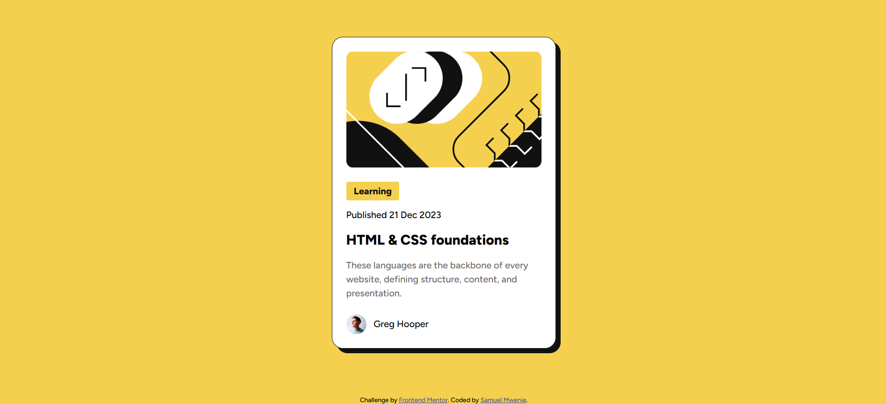

# Frontend Mentor - Blog preview card solution

This is a solution to the [Blog preview card challenge on Frontend Mentor](https://www.frontendmentor.io/challenges/blog-preview-card-ckPaj01IcS). Frontend Mentor challenges help you improve your coding skills by building realistic projects.

## Table of contents

- [Overview](#overview)
  - [The challenge](#the-challenge)
  - [Screenshot](#screenshot)
  - [Links](#links)
- [My process](#my-process)
  - [Built with](#built-with)
  - [What I learned](#what-i-learned)
  - [Continued development](#continued-development)

## Overview

### The challenge

- Is to build out this blog preview card and get it looking as close to the design as possible.

### Screenshot



### Links

- Solution URL: [Add solution URL here](https://your-solution-url.com)
- Live Site URL: [Add live site URL here](https://your-live-site-url.com)

## My process

### Built with

- Semantic HTML5 markup
- CSS custom properties
- Flexbox

### What I learned

- I explored different methods to create layouts that adapt well to all screen sizes.
- I practiced multiple ways to vertically and horizontally center content, gaining a deeper understanding of how each approach works and when to use them.
- I refined my understanding of using semantic HTML elements like <header>, <main>, <section>, and <footer> to create cleaner, more accessible markup.

To see how you can add code snippets, see below:

```css
.container {
  min-height: 100vh;
  display: flex;
  justify-content: center;
  align-items: center;
  padding: 24px;
}
color: papayawhip;
```

### Continued development

- I aim to expand my JS skills by creating more dynamic components—such as modals, accordions, menus, and animations—while ensuring they remain accessible and performant.

- I want to continue improving with CSS Grid, layered layouts, and new features like subgrid to create more sophisticated page structures.
